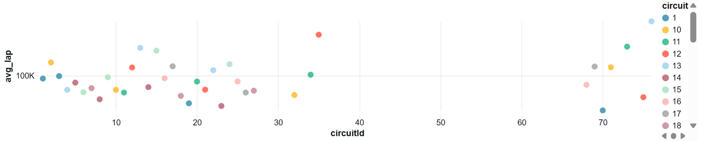

# Motorsport Analytics Lakehouse – Azure Databricks Serverless

## Project Overview
The **Motorsport Analytics Lakehouse** is an end-to-end **Serverless Data Engineering and Analytics Platform** built on **Azure Databricks** using **Medallion Architecture** and **Delta Lake**.

The project demonstrates real-world enterprise workflows including:
- Data ingestion
- Transformation & cleansing
- Star schema modeling
- Performance optimization
- Automated ETL pipelines
- Advanced SQL analytics
- Dashboard visualization

This solution simulates an **industry-grade analytics platform** for motorsport performance insights and business intelligence reporting.

---

## Tech Stack
- **Azure Databricks (Serverless Compute)**
- **Delta Lake**
- **Spark SQL / PySpark**
- **Databricks SQL Warehouse**
- **GitHub (Version Control)**
- **Dashboard Visualization**

---

## Medallion Architecture

| Layer | Description |
|------|------------|
| **Bronze** | Raw data ingestion from CSV/JSON files |
| **Silver** | Data cleansing, deduplication, validation, transformations |
| **Gold** | Star schema modeling, KPIs, analytical datasets |

---

## Data Modeling – Star Schema

### Dimension Tables
- `dim_drivers`
- `dim_circuits`
- `dim_constructors`

### Fact Tables
- `fact_race_results`
- `fact_lap_performance`

---

## Key Features Implemented
- Window Functions (`ROW_NUMBER`, `RANK`, `PERCENT_RANK`)
- Advanced Aggregations & Analytics
- Partitioning for Performance Optimization
- Data Validation & Quality Checks
- Automated ETL Job Scheduling
- SQL Dashboards & Visualization
- Serverless Compute Workflow
- Git-based Version Control

---

## Performance Optimizations
- Table Partitioning on `raceId`
- Delta Table Optimization
- Efficient Join Strategies
- Query Performance Monitoring

---

## Dashboards

### Fastest Driver Leaderboard


### Constructor Win Percentage


### Circuit Difficulty Index


---

## Project Workflow
1. Upload datasets to Databricks Workspace  
2. Execute **Bronze Ingestion Notebook**  
3. Execute **Silver Transformation Notebook**  
4. Execute **Gold Modeling Notebook**  
5. Run **Visualization Queries**  
6. View Dashboards in SQL Warehouse  
7. Schedule Jobs for Automation  

---

## Data Validation & Quality Checks
- Row Count Verification Across Layers
- Null Value Detection
- Duplicate Record Identification
- Business Rule Enforcement
- Schema Consistency Checks

---

## Skills Demonstrated
- Data Engineering Pipeline Design  
- SQL Analytics & Window Functions  
- Delta Lake Optimization  
- Star Schema Modeling  
- Dashboard Development  
- Automation & Monitoring  
- Git Version Control  
- Serverless Cloud Data Engineering  

---

## Folder Structure

```text
motorsport-lakehouse-databricks
 ├── notebooks/
 │    ├── 01_bronze_ingestion.ipynb
 │    ├── 02_silver_transform.ipynb
 │    ├── 03_gold_model.ipynb
 │    ├── 05_window_analytics.ipynb
 │    └── 06_validation.ipynb
 ├── dashboards/
 │    ├── fastest_driver.png
 │    ├── constructor_win.png
 │    └── circuit_difficulty.png
 └── README.md
```

---

## Future Enhancements
- Real-Time Streaming Pipelines
- Machine Learning Predictions
- CI/CD Pipeline Integration
- Data Governance with Unity Catalog
- Alerting & Monitoring Framework

---

## How to Run / Reproduce
1. Clone this repository  
2. Import notebooks into Databricks  
3. Upload sample dataset  
4. Execute notebooks in sequence  
5. Configure SQL Warehouse  
6. Run dashboard queries  

---
